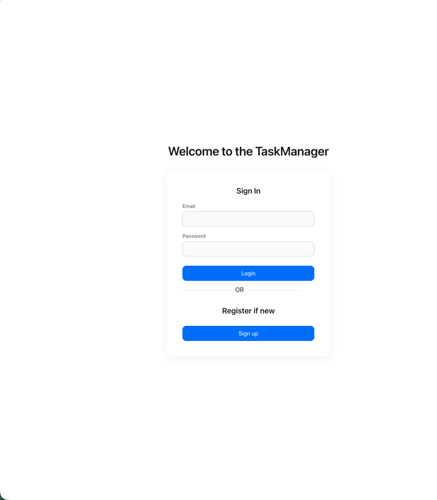
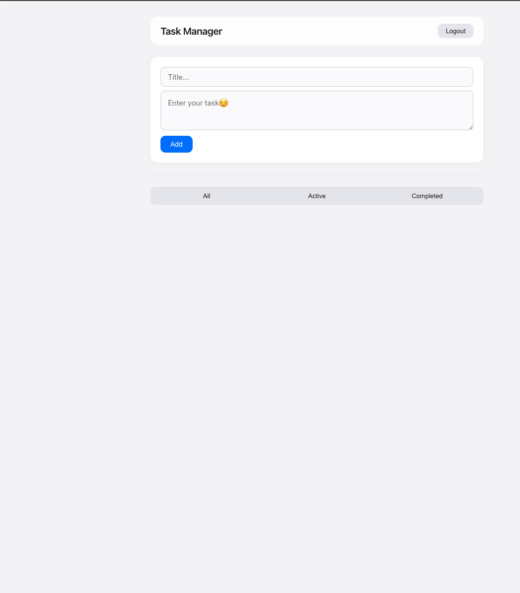
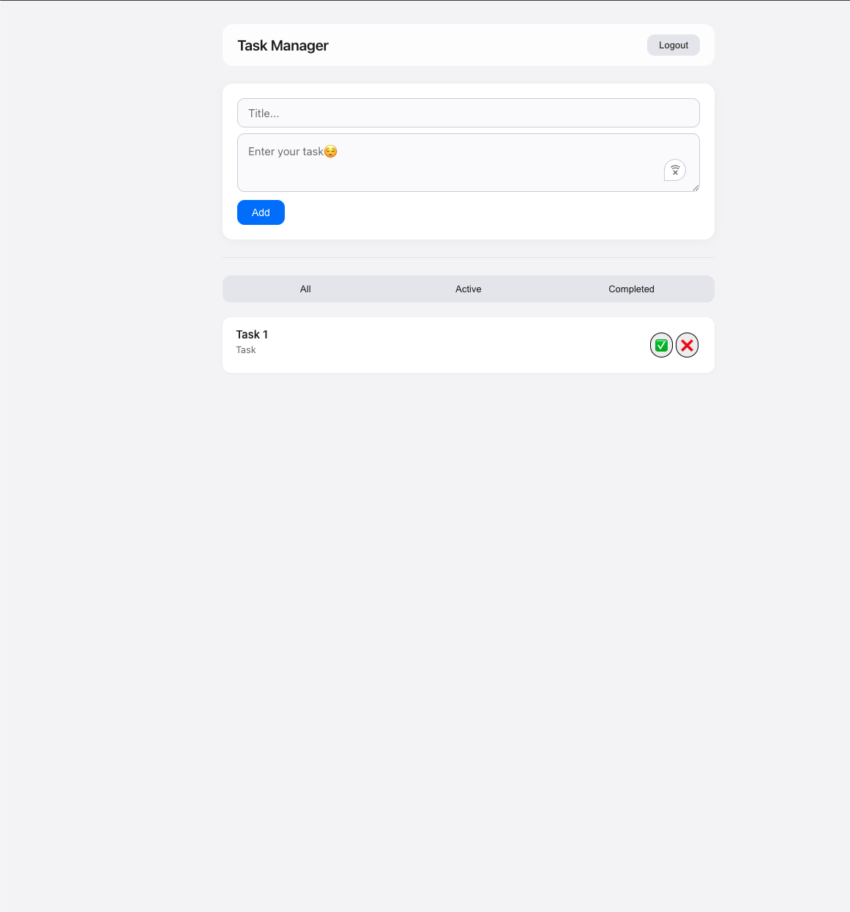

✅ Full-Stack Task Manager

Node.js | Express | PostgreSQL | React | Authentication

A full-stack task management application with user authentication, persistent data storage, and a dynamic React frontend.
This project demonstrates backend API development, authentication using sessions, and frontend state management.

🔍 About This Project
Built with Node.js, Express, PostgreSQL, and React
Implements user authentication (login/register/logout)
Uses sessions stored in PostgreSQL
Full CRUD functionality for tasks
Frontend built with React and connected via API

🚀 Live Demo
https://task-manager-fibo.onrender.com

🧠 What I Learned
Building a full-stack application with frontend + backend separation
Implementing authentication using Passport.js and sessions
Hashing passwords securely with bcrypt
Managing state in React using useState and useEffect
Protecting routes and handling user sessions
Designing API endpoints and connecting them to a frontend
Working with PostgreSQL for persistent data storage

🛠️ Tech Stack
Backend
Node.js
Express.js
PostgreSQL
Passport.js (Local Strategy)
express-session
bcrypt

Frontend
React.js
JavaScript (ES6+)
Axios
Other Tools
Render (deployment)
dotenv
Git & GitHub

⚙️ Features
User registration and login authentication
Session-based authentication (persistent login)
Create tasks with a title and description
Mark tasks as complete
Delete tasks
Filter tasks (All / Active / Completed)
Protected dashboard (only accessible when logged in)

📸 Screenshots

🧪 Installation
1. Clone Repo
git clone https://github.com/Baffyy/Task__Manager.git
cd Task__Manager
2. Install Dependencies

Backend:
npm install

Frontend:
cd Task_Manager_UI/task_manager_ui
npm install
npm run build

🔐 Environment Variables
Create a .env file:
PORT=3000
DB_USER=your_db_
userDB_HOST=localhost
DB_DATABASE=your_db_name
DB_PASSWORD=your_password
DB_PORT=5432
SECRET=your_session_secret
SALTROUNDS=10

🗄️ Database Schema
Users Table
CREATE TABLE users (  
id SERIAL PRIMARY KEY,  
email TEXT UNIQUE NOT NULL,  
password TEXT NOT NULL);

Tasks Table
CREATE TABLE tasks (  
id SERIAL PRIMARY KEY,  
title TEXT,  
description TEXT,  
status TEXT DEFAULT 'pending',  
user_id INTEGER REFERENCES users(id));

🔌 API Routes
Auth
POST /register → Register user
POST /login → Login user
POST /logout → Logout

Tasks
GET /dashboard → Get user tasks
POST /dashboard → Add task
POST /done → Mark task complete
POST /delete → Delete task

📌 Project Status
✅ Full-stack functionality complete
🔄 Improving UI and adding features

📈 Future Improvements
Add due dates and task priorities
Improve UI/UX (modern design)
Add drag-and-drop task management
Convert to JWT auth (advanced)
Deploy frontend separately (Vercel)

🔗 Links
GitHub Repo: https://github.com/Baffyy/Task__Manager
Live App: https://task-manager-fibo.onrender.com/

